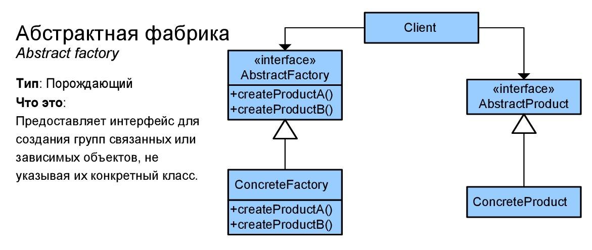

# Порождающие (creational) паттерны

Данные паттерны выделяют процесс инстанцирования (создания экземпляра класса).
С помощью них система перестает зависеть от метода формирования композиции и представления объектов.

- [**Prototype (Прототип)**](prototype/)

    Такой шаблон задаёт типы создаваемых объектов посредством экземпляра-прототипа. Более того, копируя прототип, паттерн формирует новые объекты. При использовании этого шаблона вы сможете отойти от реализации и придерживаться принципа «программирование через интерфейсы». В роли возвращающего типа выступает указанный интерфейс/абстрактный класс на вершине иерархии. При этом классы-наследники могут подставить в это место наследника, выполняющего реализацию данного типа. Иными словами, прототип позволяет создать объект посредством клонирования, а не с помощью конструктора.

    

- [**Factory method (Фабричный метод)**](factory_method/)

    Шаблон, который определят общий интерфейс для формирования объектов в суперклассе. Данный метод даёт подклассам возможность изменять вид создаваемых объектов.

    

- [**Abstract factory (Абстрактная фабрика)**](abstract_factory/)

    Это порождающий паттерн проектирования, который предоставляет интерфейс для создания семейств взаимосвязанных или взаимозависимых объектов, без непосредственной спецификации их конкретных классов. Реализация такого шаблона обеспечивается за счёт создания абстрактного класса Factory. Этот класс выступает в качестве интерфейса для создания компонентов системы (скажем, применительно к оконному интерфейсу он может формировать окна и кнопки). После всего этого пишутся классы, которые реализуют данный интерфейс.

    

- [**Singleton (Одиночка)**](singleton/)

    Очередной порождающий паттерн. С помощью него обеспечивается наличие единственного экземпляра класса с глобальной точкой доступа в однопоточном приложении.

    

- [**Builder (Строитель)**](builder/)

    Полезный порождающий паттерн, который, по сути, является методом создания составного объекта. Он дифференцирует сложный объект на конструирование и представление. Благодаря этому при выполнении одной и той же операции конструирования вы можете получить разные представления.

    